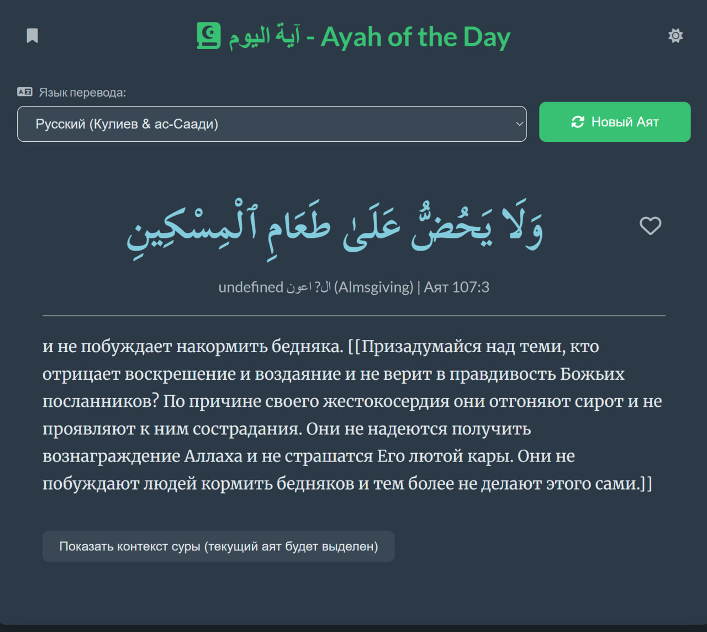
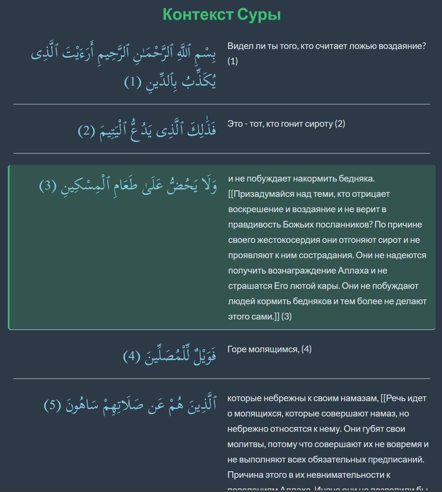
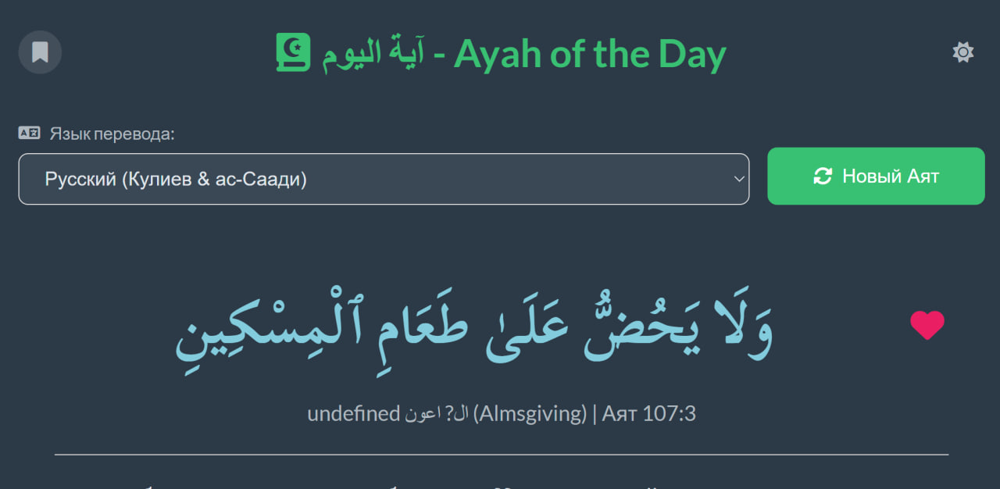
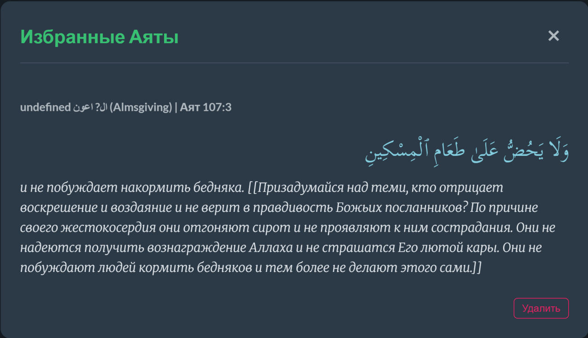
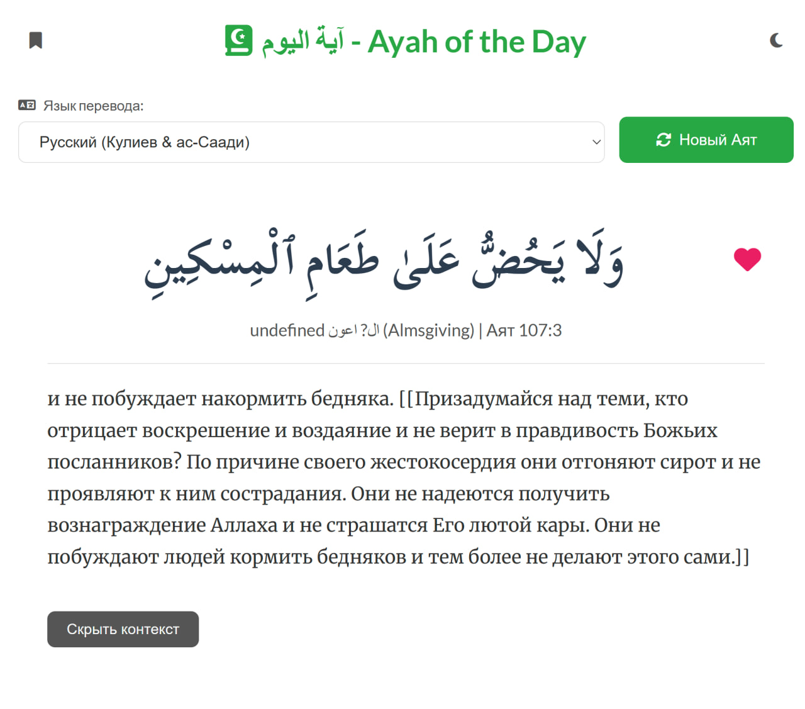

# Website with random verse from Quran with context
You should wait 2-6 second in the beginning for data to be downloaded on your machine.

You can see tafseer on 36 languages, context for each ayah and choose favourite ones to read them whenever you want.

## [Available](https://chehmet.github.io/RandomSentenceQuran/)
## Main page:

## Context of ayah

## Favourite ayah

## Dark/Light theme

In case of any problems, feel free to text me [in telegram](https://t.me/Chehmet)
